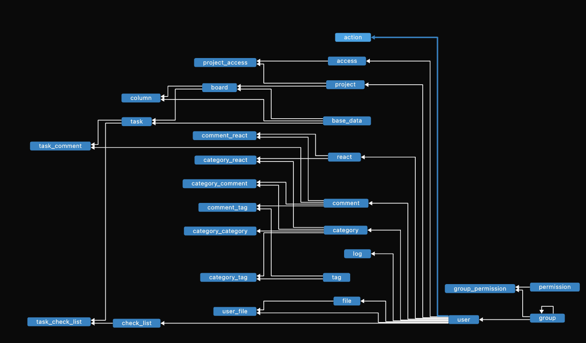

# TaskFlow

TaskFlow is a full-featured task management system similar to Trello, built using FastAPI and Tortoise ORM. It provides an intuitive and efficient way to manage projects, tasks, and teams with a scalable and production-ready architecture.



## Features

- **User Authentication & Authorization**: Secure authentication system with role-based access control.
- **Project & Board Management**: Organize tasks into boards and columns for better workflow management.
- **Task Tracking**: Assign tasks to users, set due dates, and track progress.
- **Commenting System**: Add comments to tasks for better communication and collaboration.
- **File Uploads**: Attach files to tasks for enhanced project documentation.
- **Real-time Notifications**: Stay updated with task changes and mentions.
- **Activity Logs**: Track user actions and maintain a history of changes.
- **Scalable & Production-Ready**: Built with best practices for deployment and scaling.

## Installation

### Prerequisites

Ensure you have the following installed:

- Python 3.10+
- PostgreSQL or SQLite (for local development)
- Redis (for task queues and caching)

### Setup

```sh
git clone https://github.com/MohammadrezaAmani/task_flow.git
cd task_flow
python -m venv venv
source venv/bin/activate  # On Windows use `venv\Scripts\activate`
pip install -r requirements.txt
uvicorn src:app --host 0.0.0.0 --port 8000 --reload
```

## API Documentation

Once the server is running, you can access the interactive API docs at:

- [Swagger UI](http://localhost:8000/docs)
- [ReDoc](http://localhost:8000/redoc)

## License

This project is licensed under the MIT License. See the `LICENSE` file for more details.

## Contact

For support or inquiries, please contact **[more.amani@yahoo.com](mailto:more.amani@yahoo.com)** or [open an issue on GitHub](https://github.com/MohammadrezaAmani/task_flow/issues).
